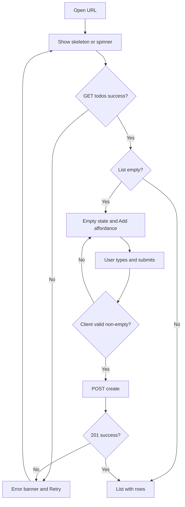
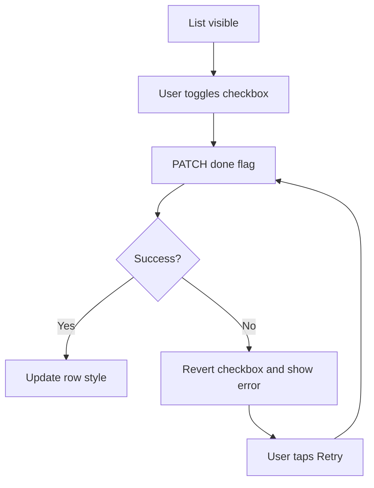
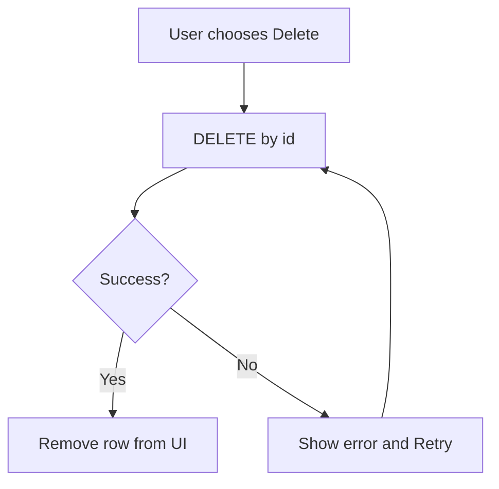
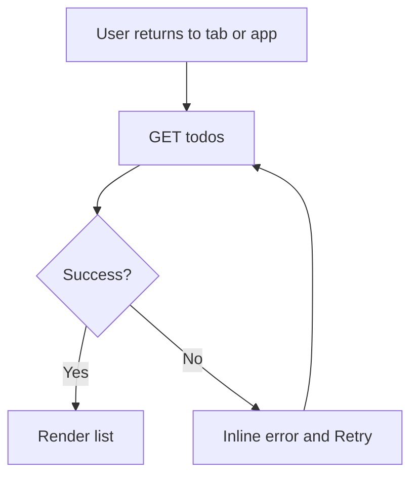
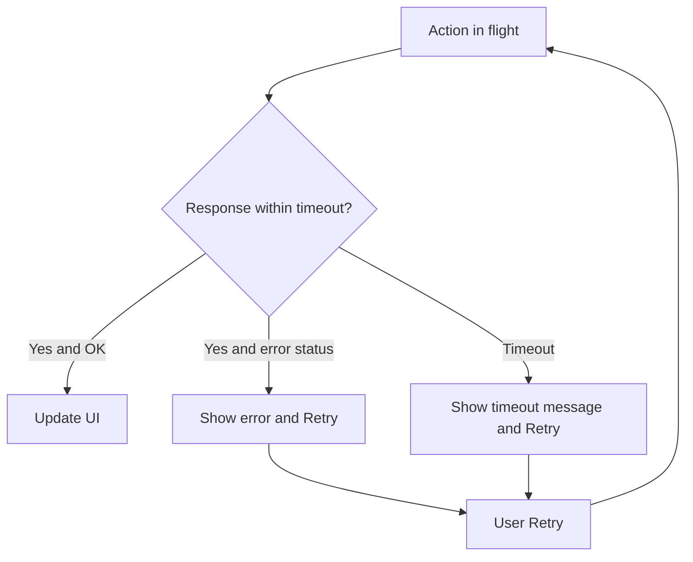

---
stepsCompleted:
  - 1
  - 2
  - 3
  - 4
  - 5
  - 6
  - 7
  - 8
  - 9
  - 10
  - 11
  - 12
  - 13
  - 14
lastStep: 14
workflowCompletedAt: "2026-05-02T00:00:00Z"
inputDocuments:
  - "./prd.md"
  - "./product-brief-todo-app.md"
workflowType: ux-design
---

# UX Design Specification — lets-do-it

**Author:** Gauravsingh  
**Date:** 2026-05-02

---

## Executive Summary

### Project Vision

**Lets-do-it** is a minimal **full-stack personal todo** web app: one user, one list, **add → see → toggle done → delete**, with **durable server-backed** state. V1 optimizes **clarity and trust** (list visible immediately, no auth friction) over feature breadth. **Text is immutable after create**; updates are **completion state only**. The product should feel **finished** through strong **empty, loading, and error** states and **obvious active vs completed** visuals—aligned with WCAG **2.1 AA** for primary flows (NFR-07).

### Target Users

- **Primary:** Solo knowledge workers, students, and professionals who want a **private scratch list** for the day or week—fast capture, glanceable status, **mobile and desktop**, no onboarding wall.
- **Secondary:** Developers **evaluating or extending** the repo—clear UI boundaries that map to a small API and readable patterns.

Users are generally **tech-comfortable** but should not need documentation to complete the **core loop** (SC-01).

### Key Design Challenges

1. **Zero-friction first run** — First screen must communicate “add a task here” without tutorials (UJ-1, FR-07).
2. **Perceived speed** — Mutations should feel **instant** after server OK (SC-04, NFR-02); avoid layouts that jank on update.
3. **Trust on failure** — Network/server errors must be **visible and recoverable**, not silent spinners (UJ-6, FR-09).
4. **Touch + keyboard** — Same flows work on **narrow viewports** and desktop (responsive targets in PRD).
5. **Destructive clarity** — Delete is **irreversible** in V1; control labeling must beat ambiguous icon-only patterns where possible (UJ-4).

### Design Opportunities

1. **“Quietly premium” minimal UI** — Polish on basics (typography, spacing, motion on state change) differentiates from noisy competitors (brief + Innovation).
2. **Scan-first list** — Strong **visual hierarchy** for done vs active makes the list scannable in seconds (UJ-2).
3. **Honest empty state** — Empty state doubles as **onboarding by layout** (primary add affordance).
4. **SEO-safe shell** — When publicly reachable, **`noindex` + stable `<title>`** (PRD) avoids accidental SEO debt without building marketing surfaces in V1.

## Core User Experience

### Defining Experience

The **defining experience** is a **single scrollable list** as the home surface: user opens the app and **immediately** sees todos or a purposeful **empty state** with one obvious **add** action. The **highest-frequency** actions are **toggle done** and **add**; **delete** is secondary but must stay **clear and deliberate**. Success is when the app **disappears**—users act on tasks, not on the UI.

### Platform Strategy

- **Web-first:** Responsive **SPA or MPA**; primary input **touch on mobile**, **mouse/keyboard on desktop** (no separate native app in V1).
- **Networked:** Assumes connectivity; **no offline mode** in V1—errors communicate **try again** instead of pretending local authority.
- **Shell:** Respect **SEO/indexing** stance: default **`noindex`** + stable **`<title>`** when exposed on the public web (PRD Project-Type).

### Effortless Interactions

- **Add:** Single field + submit (or inline add row)—**minimal fields** (text only in V1).
- **Toggle done:** One tap/click; **fast confirmed** update per NFR-02; completed styling **obvious at a glance** (FR-10).
- **List load:** **Loading** skeleton or spinner with **timeout messaging** (UJ-6)—never an infinite blank wait.
- **Errors:** **Plain language** + **retry** or reload guidance (FR-09, SC-05).

### Critical Success Moments

1. **First item** — User adds the first todo **without instructions** (SC-01, UJ-1).
2. **Post-refresh trust** — List matches what they left (SC-02, UJ-5).
3. **Failure path** — API down: user still **orients** and can retry (UJ-6).

### Experience Principles

1. **Clarity over cleverness** — No hidden gestures for core actions.
2. **State honesty** — Every view has a deliberate **empty / loading / error / success** state.
3. **One list, one truth** — Server-backed list is source of truth; UI reflects it predictably.
4. **Accessible by default** — Focus order, names, contrast, and motion that respect **WCAG 2.1 AA** targets on add / complete / delete flows.
5. **Respect attention** — No accounts, notifications, or scope creep in the chrome for V1.

## Desired Emotional Response

### Primary Emotional Goals

- **Calm focus** — The UI feels like a **quiet desk**, not a dashboard product; low visual noise supports “get in, capture, leave.”
- **Confidence** — Users trust that **what they see is what is stored**; successful actions give **immediate, legible** feedback.
- **Light competence** — Completing the core loop feels **obvious and slightly satisfying**, not gamified.

### Emotional Journey Mapping

| Stage | Desired feeling | UX support |
|--------|-------------------|------------|
| **First open** | Welcoming clarity, not emptiness anxiety | Purposeful empty state + single primary add |
| **Core use** | Flow, low cognitive load | Fast list updates, clear done vs active |
| **After completing work** | Closure | Completed items readable but de-emphasized |
| **When something fails** | Informed, not blamed | Clear error copy, retry, no dead-end spinners |
| **Return visit** | Familiar reliability | Same layout, persistent data |

### Micro-Emotions

- **Prioritize:** Trust, clarity, mild accomplishment on toggle/delete.  
- **Avoid:** Confusion (mystery icons), anxiety (unclear data loss), cynicism (“toy app” jank on refresh).  
- **Delight (subtle):** Micro-motion on state change, crisp typography—**never** at the cost of speed or a11y.

### Design Implications

- **Calm focus** → Restrained palette, generous whitespace, one primary CTA per view.  
- **Confidence** → Optimistic UI only where rollback is safe; otherwise **confirm server outcome** before celebrating.  
- **Trust on failure** → Human-readable errors, **Retry** always visible when action failed.  
- **Competence** → Visible **focus rings**, logical tab order, hit targets ≥ 44px where practical (touch).

### Emotional Design Principles

1. **Never punish curiosity** — First-time exploration should not trigger dead ends or cryptic errors.  
2. **Recover before redirect** — Prefer inline recovery over kicking users to a generic error page for list failures.  
3. **Earn trust with consistency** — Same patterns for loading/error across add, toggle, delete.  
4. **Emotion follows function** — Delight comes from **speed + clarity**, not decorative noise.

## UX Pattern Analysis & Inspiration

### Inspiring Products Analysis

| Reference | What they do well (UX) | Relevance to lets-do-it |
|-----------|-------------------------|-------------------------|
| **Apple Reminders / system lists** | Single surface, clear check-off, native feel, predictable motion | **List-first** layout, **toggle** affordance, platform-respecting density |
| **Things / Cultured Code–style productivity** | Calm typography, whitespace, inbox clarity | **Calm focus** emotional goal; avoid clutter |
| **Google Tasks (web)** | Fast add, flat list, obvious complete | **Low-friction add** + **done** state at a glance |
| **Linear (issue list)** | Keyboard-friendly rows, crisp empty states | Optional **density** target for secondary “builder” audience |

### Transferable UX Patterns

**Navigation**

- **Single-home list** — No tab bar required for V1; one primary surface matches PRD scope.
- **Sticky add** — Composer pinned top or bottom on mobile so “add” is always one gesture away.

**Interaction**

- **Checkbox / toggle row** — Completing a task is a **single primary control** per row (FR-04/05, FR-10).
- **Inline optimistic + reconcile** — If used: brief pending state then lock to server truth (trust).
- **Pull-to-refresh (mobile)** — Optional pattern for **return visit** trust (UJ-5); not required if auto-refresh on focus is simpler.

**Visual**

- **Muted completed rows** — Strikethrough + reduced contrast supports scan (UJ-2).
- **Skeleton / short spinner** for initial load — Supports **loading** honesty (FR-08).

### Anti-Patterns to Avoid

- **Mystery-meat icons** for delete without label/tooltip (UJ-4).
- **Infinite spinners** with no timeout or copy (UJ-6).
- **Modal overload** for every CRUD action — breaks speed and calm.
- **Fake offline** or silent local-only writes when server is authoritative (conflicts with PRD).
- **Gamification** (streaks, badges) — out of V1 scope and fights **calm focus**.

### Design Inspiration Strategy

**Adopt:** Single-list home, strong empty state, clear done/active styling, explicit error + retry.  
**Adapt:** “Pro” density from dev tools—**only** if it stays readable on mobile; default to **comfortable** touch spacing.  
**Avoid:** Feature chrome (accounts, tabs, smart lists) that belongs in Growth, not V1.

## Design System Foundation

### 1.1 Design System Choice

**Primary stack:** **Tailwind CSS** (utility layout + design tokens) **+ Radix UI** (unstyled, accessible primitives for checkbox, focus trap, dialog if needed) **+ optional shadcn/ui-style patterns** (copy-in components built on Radix + Tailwind).

**Classification:** **Themeable system** — not a full Material/Ant visual language; keeps **brand flexibility** and matches “quiet desk” emotional goals.

### Rationale for Selection

- **Accessibility:** Radix patterns support keyboard, focus, and ARIA expectations aligned with NFR-07 and Domain Requirements.
- **Speed:** Tailwind + composable components shorten V1 delivery vs. fully bespoke CSS.
- **Visual restraint:** Easier to enforce **calm, low-chrome** UI than heavy Material defaults (which would fight the brief).
- **Maintenance:** Widely documented; fits a **reference-quality** open repo for builders.

### Implementation Approach

1. **Tokens first** — Define CSS variables or `tailwind.config` theme for **color, radius, spacing, type scale** (light mode V1; dark optional Growth).
2. **Primitives** — Button, input, checkbox/toggle, list row container, inline alert/banner for errors (map to FR-07–FR-10, FR-09).
3. **Layout** — Single column list; **max-width** readable line length on desktop; full-bleed on mobile.
4. **Motion** — **Sub-200ms** transitions on done state only where motion is not reduced (respect `prefers-reduced-motion`).

### Customization Strategy

- **Brand:** Neutral **slate/zinc** base + **one accent** for primary actions (add, retry); avoid rainbow marketing gradients.
- **Density:** Default **comfortable**; optional compact toggle **not** in V1 unless PRD expands.
- **Icons:** **Lucide** (or similar minimal set) with **text labels** for destructive actions where possible (UJ-4).
- **Escape hatch:** Any component that fights a11y or calm aesthetic may be **rebuilt locally** while keeping token contracts.

## 2. Core User Experience

*Deepening the defining interaction; see also **§ Core User Experience** above for the summary principles.*

### 2.1 Defining Experience

**One-sentence product gesture:** *“Open the app, see my list, add or check off a task in one breath.”*  
If we nail **list clarity + instant toggle + trustworthy load/error**, the product feels “real” despite minimal scope.

### 2.2 User Mental Model

Users treat the app like a **scratchpad or sticky stack**: one surface, newest or most relevant items on top, **checkmark = done** (not “archived to another dimension”). They expect **refresh = same data** and **no account** to mean **no setup**—not “data might vanish.” Confusion spikes when **done vs active** is ambiguous or when **delete** looks like “archive.”

### 2.3 Success Criteria

- **“It just works”** — Add → appears in list; toggle → state sticks after refresh (SC-02, FR-04/05).
- **Felt speed** — UI reflects server success within **≤ 1 s P95** perception (SC-04, NFR-02).
- **Orientation on failure** — User always knows **what failed** and has **retry** (FR-09, UJ-6).
- **No coaching** — Core loop completable **without** help copy (SC-01).

### 2.4 Novel UX Patterns

**Established-first:** Checkbox/toggle list, sticky composer, empty state CTA—**no novel gesture language** required.  
**Small twist:** **Calm** execution (restrained chrome + typography) rather than feature novelty—differentiation is **craft**, not a new interaction model.

### 2.5 Experience Mechanics

**A. Add todo**

1. **Initiation:** User taps primary **Add** / focuses inline field (empty state or list footer/header).  
2. **Interaction:** Enter text (≤ 500 chars); submit via button or Enter; **validate** non-empty client-side before POST.  
3. **Feedback:** Pending row or composer disabled + spinner; success → row appears **sorted by `createdAt` desc**; failure → inline error + retry.  
4. **Completion:** Field clears; focus returns to add affordance or new row.

**B. Toggle complete**

1. **Initiation:** Tap checkbox / row control.  
2. **Interaction:** PATCH/PUT `done`; optional brief optimistic UI.  
3. **Feedback:** Row style updates (strikethrough/mute per FR-10); error restores prior state + message.  
4. **Completion:** No separate “save”—**server truth** ends the interaction.

**C. Delete**

1. **Initiation:** Explicit control (icon **+** label or overflow labeled “Delete”).  
2. **Interaction:** DELETE by id; **one-step** delete in V1 (no undo) with clear labeling—not a mystery icon.  
3. **Feedback:** Row animates out or greys pending; error leaves row + message.  
4. **Completion:** List count updates; empty state returns if last item removed.

## Visual Design Foundation

### Color System

- **Base:** Cool neutrals (**zinc / slate** scale) for surfaces, borders, and primary text — supports long sessions without visual fatigue.
- **Semantic tokens (conceptual):**
  - **background** / **surface-raised** — page vs card/list row hover
  - **border-subtle** — row dividers
  - **text-primary** / **text-muted** — body vs secondary meta (timestamps optional in Growth)
  - **accent** — primary button, focus ring, link-style retry
  - **destructive** — delete control (icon + text); use **sparingly**
  - **success** (optional subtle) — toast or inline “Saved” if used; avoid loud green chrome
  - **error** — inline alert background + text meeting **≥ 4.5:1** on body (WCAG AA)
- **Completed todo treatment:** Lower contrast text + optional strikethrough; **not** a separate “success green” per row (keeps calm).
- **Dark mode:** Out of V1 unless trivial via CSS variables; document token slots for later.

### Typography System

- **Tone:** Modern, neutral, **system-ui stack** first (`system-ui, …`) for zero FOIT; optional **Inter** or **Geist** if webfont added.
- **Scale (rem-based):** `text-sm` meta / controls, `text-base` body, `text-lg` empty-state headline, **single weight hierarchy** (regular + semibold for titles/buttons).
- **Line height:** Relaxed for empty/error paragraphs (`leading-relaxed`); tighter for dense list rows if needed.
- **Numeric tabular:** Optional `tabular-nums` for any future timestamps.

### Spacing & Layout Foundation

- **Base unit:** **4px** grid (Tailwind default); touch targets **min 44×44px** for checkbox and primary actions.
- **Layout:** Single column; **max-width ~40rem** on large screens for readability; **16px** horizontal safe area on mobile.
- **List rhythm:** **12–16px** vertical padding per row; **8px** gap between checkbox and title.
- **Composer:** Full-width on mobile; constrained width on desktop aligned with list.

### Accessibility Considerations

- **Contrast:** All text/background pairs target **WCAG 2.1 AA** (NFR-07); destructive and error states checked with automated contrast audit in CI.
- **Focus:** **Visible focus ring** (accent) on every interactive element; order follows visual order (add → list top → bottom).
- **Motion:** Honor **`prefers-reduced-motion`**: reduce or remove row transition when set.
- **Semantics:** One **`h1`** app title; list **`ul`/`li`** or table with **`role`** as appropriate; checkbox **`aria-checked`** synced to `done`.

## Design Direction Decision

### Design Directions Explored

- **HTML showcase:** `./ux-design-directions.html` — Directions **A** (classic calm), **B** (warm paper), **C** (high contrast dense), **D** (soft minimal).
- **Evaluation:** A best matches **calm focus** + **WCAG AA** + **Tailwind/Radix** plan; C useful as stress-test for contrast; B/D as optional brand pivots.

### Chosen Direction

**Direction A — Classic calm** (zinc neutrals + blue accent, comfortable spacing, `rounded-md` chrome). Use B/C/D only for targeted component experiments unless product repositions.

### Design Rationale

- Aligns with **Desired Emotional Response** (calm, confidence) and **Visual Design Foundation** (zinc base + single accent).
- Pairs cleanly with **Design System Foundation** (Tailwind + Radix + optional shadcn-style).
- Lowest risk for **NFR-07** contrast automation on default path.

### Implementation Approach

- Implement **tokens** in Tailwind theme first mapping Direction A surfaces, text, accent, destructive, error.
- Keep **Direction C** as a **contrast check** story in QA (optional screenshot fixture).
- Revisit **B** or **D** only if marketing asks for warmer or friendlier brand without scope change.

## User Journey Flows

### First visit and first task (UJ-1)

User lands with **no todos**: show **loading** (short) → **empty state** with one primary **Add** CTA and short line of copy (“Nothing here yet”). User enters text, submits → **POST** → success adds row at top (`createdAt` desc); composer clears and focus stays useful. Validation: block empty/whitespace with inline message (no modal).

### Steady use — add and toggle (UJ-2, UJ-3)

List visible; user adds more items same as above. **Toggle:** tap checkbox → optional optimistic UI → **PATCH** → on success update style (muted or strikethrough); on failure revert checkbox and show **inline error** with **Retry**.

### Delete task (UJ-4)

User triggers **Delete** (labeled control or labeled overflow). **DELETE** request → on success remove row with short animation; on failure keep row + error. **No undo** in V1 — copy must not imply archive.

### Return visit (UJ-5)

On focus or mount after first visit: **GET** list; show brief loading if stale; render server order; hard refresh must match PRD SC-02.

### Backend slow or down (UJ-6)

Mutations: disable control or show row-level pending; **timeout** surfaces **Try again** and does not spin forever. Initial load: same timeout → error state with retry.

### Journey patterns

- **Single surface:** All flows resolve on **one list view** — no secondary tabs in V1.
- **Inline first:** Errors and validation prefer **inline** over modal except unavoidable system dialogs.
- **Retry contract:** Any failed **GET/POST/PATCH/DELETE** exposes **Retry** that repeats the same operation.
- **Loading honesty:** Distinct **skeleton/spinner** states; never blank screen with hidden activity.

### Flow optimization principles

1. **Minimize steps to first value** — One field add, no wizard.
2. **Reduce branching in the chrome** — Decisions happen in-row, not deep menus.
3. **Server truth ends the story** — After success, UI matches server; no extra “Saved” modal unless a lightweight toast is adopted later.
4. **Accessible order** — Tab: add → first row controls → down the list; optional **skip link** if list grows (Growth).

## Component Strategy

### Design system components

From **Tailwind + Radix (+ optional shadcn-style)** — use primitives first, extend only where needed:

| Primitive | Use for |
|-----------|---------|
| **Button** | Primary Add, Retry, optional secondary actions |
| **Text field / Input** | Todo text (max length enforced in logic) |
| **Checkbox or Switch** | Done toggle (Radix Checkbox with custom label hit area) |
| **Separator** | Row dividers / section breaks |
| **ScrollArea** (optional) | Long lists on small viewports |
| **Visually hidden** | Screen-reader-only labels where UI is icon+text |

### Custom components

#### TodoRow

- **Purpose:** One line item: toggle done, title text, delete.  
- **Anatomy:** [leading control] [title] [trailing delete].  
- **States:** default, hover, focused, done (muted/strike), pending (mutation), error (inline message slot).  
- **A11y:** `aria-checked` on toggle; row `aria-busy` when pending; delete has **accessible name** (“Delete {title}”).  
- **Interaction:** Click toggle → PATCH; click delete → DELETE (no undo).

#### AddComposer

- **Purpose:** Capture new todo text.  
- **States:** empty, typing, submitting (disabled + spinner), error (inline).  
- **A11y:** `label` associated with input; Enter submits; `aria-live="polite"` on validation error.

#### EmptyState

- **Purpose:** Zero todos — invite first add.  
- **Content:** Short headline + one primary button or embedded composer.  
- **A11y:** Region landmark or heading level appropriate under `h1`.

#### ListShell / AppFrame

- **Purpose:** Page chrome: `h1`, optional subtle header meta, list container, composer placement.  
- **SEO:** `noindex` + `<title>` per PRD (handled outside React if MPA, or head manager if SPA).

#### ErrorBanner (inline)

- **Purpose:** GET failure or global mutation failure.  
- **States:** visible with message + Retry; dismissed on successful refetch (optional).  
- **A11y:** `role="alert"` for critical load failures; consider moving focus to banner on first error (document for QA).

### Component implementation strategy

1. **Token-first** — All custom pieces use CSS variables / Tailwind theme (Direction A).  
2. **Composition** — `TodoRow` composes Radix Checkbox + tokens; no one-off hex in row.  
3. **Testing** — Storybook or Ladle optional; **minimum** = RTL + axe on list view per NFR-07.

### Implementation roadmap

**Phase 1 — Ship core loop**

- `AppFrame` / `ListShell`, `AddComposer`, `TodoRow`, `EmptyState`, `ErrorBanner` (inline).

**Phase 2 — Polish**

- Loading skeleton variant, reduced-motion path, optional toast for repeated errors.

**Phase 3 — Growth (out of V1)**

- Edit text row, archive/undo, filters, settings surface.

## UX Consistency Patterns

### Button Hierarchy

| Level | Use | Visual (Direction A) |
|-------|-----|----------------------|
| **Primary** | Add, Retry after failure | Filled accent button |
| **Secondary** | Rare alternate actions (e.g. “Cancel” if a dialog appears in Growth) | Ghost or outline |
| **Destructive** | Delete | Destructive token; **always** paired with text label or visible `aria-label` |

**Rules:** At most **one** primary button in the viewport for the V1 list screen. Icon-only buttons are forbidden for **delete**.

### Feedback Patterns

| Type | When | Pattern |
|------|------|---------|
| **Loading** | Initial GET, mutation in flight | Skeleton rows or inline spinner on composer; **timeout** → error |
| **Success** | Mutation OK | Update list in place; **no** blocking success modal |
| **Error** | 4xx/5xx, timeout, network | Inline row message or **ErrorBanner** + **Retry**; `role="alert"` for blocking load failure |
| **Info** | Optional hints | Subtle text under composer only if needed; avoid toast spam in V1 |

### Form Patterns

- **Single-field add:** validate **non-empty** before submit; show error **under field** or `aria-describedby`.
- **Max length 500:** soft counter optional; hard block at submit with clear message.
- **No multi-step** forms in V1.

### Navigation Patterns

- **Single surface** — No tabs, drawers, or settings in V1.
- **Scroll** — List scrolls; composer **sticky** top or bottom (pick one per breakpoint and keep consistent).
- **Deep linking** — Optional Growth; V1 may be single `/` route only.

### Additional Patterns

- **Empty state** — Illustration optional; **never** without a clear primary action.
- **Done items** — Consistent **muted + strikethrough** (or one chosen treatment) across all rows.
- **Reduced motion** — Disable non-essential transitions when `prefers-reduced-motion: reduce`.
- **Focus** — After add, focus returns to **input** (default) for rapid entry; document for dev/QA if changed.

## Responsive Design & Accessibility

### Responsive Strategy

- **Mobile-first:** Layout and touch targets are designed for **320px+** width first; wider screens gain **readable max-width** (e.g. centered column) rather than multi-column chrome.
- **Desktop:** Extra width used for **comfortable line length** and optional **wider tap/hover hit areas** for row actions—not a second column of todos in V1.
- **Tablet:** Same as mobile with **slightly larger** typography/spacing if tokens allow; no tablet-only navigation pattern.
- **Composer placement:** **Sticky** composer (top or bottom—match **UX Consistency Patterns**); ensure it does not obscure focus or the first row when the keyboard opens on mobile (test on real devices).

### Breakpoint Strategy

- **Default:** Align with **Tailwind defaults** (`sm` 640px, `md` 768px, `lg` 1024px) unless the implementation stack changes—document any override in README.
- **Layout shifts:** At **`md`+**, optional **max-width container** (e.g. `max-w-lg` / `max-w-xl`) centered with horizontal padding.
- **Density:** Do not reduce touch target size below **44×44px** equivalent on small screens for toggle and delete.

### Accessibility Strategy

- **Target:** **WCAG 2.1 Level AA** for primary flows (add, complete, delete, error recovery), per PRD.
- **Contrast:** Text and interactive states meet **4.5:1** for normal text; large text and UI components per AA.
- **Keyboard:** Full operation without pointer; visible **focus ring** on all interactive elements; logical tab order (composer → list top → down rows).
- **Screen readers:** Semantic **headings** (`h1` for app title); **names** for toggle and delete; **live regions** for critical errors as specified in component/pattern sections.
- **Motion:** Respect **`prefers-reduced-motion`** for non-essential animation.

### Testing Strategy

- **Responsive:** Manual check on **at least one** iOS Safari and one Android Chrome device or emulator; verify list scroll, sticky composer, and keyboard overlap.
- **Browsers:** **Chrome, Firefox, Safari, Edge** current minus one where feasible for the list view.
- **Accessibility (automated):** CI runs **axe** (or equivalent) on the **main list view** with add/complete/delete paths exercised; **zero critical** violations (NFR-07).
- **Accessibility (manual):** Keyboard-only pass; **VoiceOver** or **NVDA** spot-check on add, error banner, and delete naming.
- **Inclusive testing:** Prefer including assistive-tech users before major releases (Growth); V1 minimum is the manual spot-check above.

### Implementation Guidelines

- **CSS:** Prefer **rem** / fluid spacing from tokens; **mobile-first** media queries.
- **HTML:** Prefer **native controls** (e.g. checkbox, button) with Radix where it improves behavior; avoid `div` buttons.
- **ARIA:** Use **only** where native semantics are insufficient; document any `aria-live` usage.
- **Images:** N/A for core list V1; any future icons need **decorative vs informative** treatment documented.
- **High contrast / forced colors:** Avoid relying on color alone for state (done vs active); verify focus visibility in forced-colors mode where supported.
